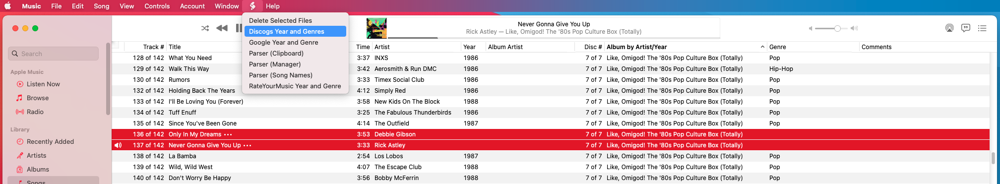
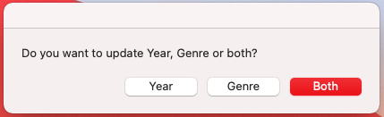
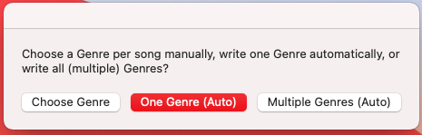
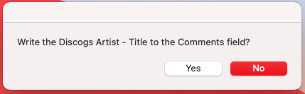
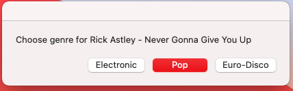
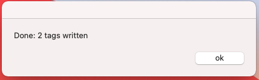
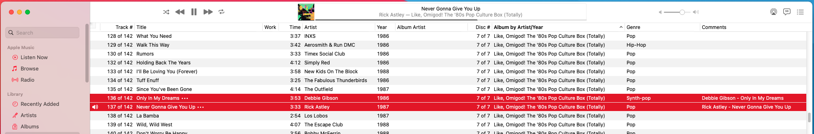

# certuna's Applescripts for Music

## Script 1: Automatic tagging of Year and/or Genres from Discogs

You are a happy macOS user, and you've successfully survived the transition from iTunes to the new Music app, introduced with macOS Catalina last year. You might like the interface, the scriptabilty, or you simply need Music to sync music to your iPhone or iPad, or stream to your AppleTV. If you have a sizeable music library, you will probably recognise these scenarios:
- You have an awesome disco compilation that was released in 2018, but contains tracks from 1975-1985. Tagging these tracks with 2018 makes little sense: your smart playlist of "70s Disco" will not pick these tracks up, and instead these tunes show up between modern songs by Jessie Ware and Dua Lipa.
- You have ripped your cherished red and blue Beatles best-of CDs, released in 1993. To your frustration, Beatles songs keep appearing in your "90s Rock" playlists.
- You have a big folder of loose tracks you downloaded on Napster back in the 1990s because you loved the videos on MTV! But they have no genre or year tags. So none of these songs ever get included in your Genre or Decade playlists, and this makes you sad.
- You have a compilation album with collected hit singles, but they're pretty diverse: Pop, Punk Rock, Hip-Hop, House, Reggaeton. But unfortunately, all songs are tagged with the same genre(s).
- You've started using a new music player that supports multiple genres, but all your tracks are tagged with one genre.
- You might have tried auto-tagging genres with some tagger using last.fm or MusicBrainz but you've found out that the genres in those databases are all over the place.

Clearly, for search/filter/smart playlists to work as expected, these songs need to be tagged with their *original* release year, and preferably, the genre of the specific song. But looking up every single song, checking its original release year and genre(s), and writing that in the tags is tedious manual work. MusicBrainz Picard is pretty awesome, but will still tag (most) compilation album tracks with the release date of the album, not the years when the original singles were released. Genres also only go on the album level. This is where this script comes in: it will try to find the *original single* on Discogs, and tag the song with that year and its specific genre(s).

### How to install:
1. Create new script in macOS Script Editor
2. Copy/paste the code from [DiscogsYearGenres.txt](https://github.com/certuna/Applescripts-for-Music/raw/main/DiscogsYearGenres.txt) to the new Applescript 
3. Replace the text `please_insert_your_own_API_key_here` in the `QueryDiscogs` function with your own [Discogs API key](https://www.discogs.com/settings/developers) (you need to set up a Discogs account if you haven't got one)
4. If you are on macOS Mojave or older, you still have iTunes. Replace the `tell application "Music"` line with `tell application "iTunes"`
4. Save the script as `Discogs Year and Genres.scpt`
5. Put this file in `/Library/Music/Scripts` (all users) or `/User/johndoe/Library/Music/Scripts` (one user). If the folder doesn't exist, create it. (note: for iTunes users, the folder is `Library/iTunes/Scripts`)
6. When you open Music, there's now a scripts dropdown menu in the top menu bar between `Window` and `Help`

### How it works in practice:
1. You select one or more songs in Music, you run the script `Discogs Year and Genres`

2. You choose to write Year, Genre or both

3. **Choose Genre**: the script will the prompt you *for each track* for the Genre to write. **One Genre (Auto)** the script will write only one Genre. **Multiple Genres (Auto)**: the script will write all genres and styles in the Genre field, separated by semicolons, for example `Pop;New Wave;Synthpop`

4. The script can optionally write the `"Artist - Release"` of the Discogs item into the Comments field, so you can check afterwards which master release this year came from.

5. The script performs a Discogs API search for `Artist SongTitle` for the 'master release' of the single, gets back the Year, Genres and Styles.
6. The script writes the tags. If you've chosen **Choose Genre** and Discogs has more than one Genre/Style for the release, you will get a popup to pick which Genre to apply (note: yes 3 items max - blame Apple since AppleScript dialog boxes max out at three buttons)

7. and shows a dialog at the end how many songs were updated

8. The Year and Genre are updated

### Notes:

**Note 1**: even though this Discogs search query specifies that only singles should be included in the search (with `&format_exact=Single`), in fact Discogs seems to ignore this, and will also return years from albums, compilations etc. Hence, I've added the option to write the Discogs "Artist - Release" to the comments field, so you can check where the hell Discogs got that year from. This script is not perfect, various things can make the search not return the 'correct' master release: special characters, misspellings, multiple artists, etc. Feel free to tweak the code to make these searches more reliable.

**Note 2**: I am aware that semicolons as genre separators are non-standard, not for mp3 nor for mp4/aac. Technically, multiple genres are not allowed *at all* in [id3v2.3](https://id3.org/id3v2.3.0#Declared_ID3v2_frames), and are defined as null-separated strings in [id3v2.4](https://id3.org/id3v2.4.0-frames). However:
- while non-standard, semicolon-separated multiple genres are nonetheless supported by many other players (such as Windows Media Player, Kodi, Plex, MusicBee, Emby, foobar2000 and DBPowerAmp)
- neither iTunes nor Apple's Music app can handle null-separated genres  (more precise: if the id3v2.4 frame is UTF-8 encoded, multiple genres look like this: `RockPopReggae`, if the frame is ISO-8859-1 encoded it will display only the first genre `Rock`). Apple developers should hang their heads in shame, it's been 20+ (!) years since id3v2.4 was published and they still can't be bothered to implement it correctly.

Anyway: for tagging in Apple Music, the choice is to either tag one genre, or tag multiple genres with another separator. I might implement 'proper' null-separated genres in the future, but first I'd have to figure out a way in Applescript to detect if a tag is UTF-8 encoded id3v2.4.

**Note 3**: Some people seem to think that the Year field in Music/iTunes should contain the re-release/reissue year. But if you read the id3v2.4 specs for `TDRL` (Release Time, the field used for Year in the macOS Music application, and Year/Release Year/Release Date in most other players), it clearly states: `The 'Release time' frame contains a timestamp describing when the audio was first released.` (i.e., not when it was re-released on some compilation, _first_ released). This is exactly what the script does: it looks up the date when the single was first released.

**Note 4** This is not a fast script. Discogs only allows 60 requests per minute for their API, so the code intentionally has a 1 second delay per track built in. If you let this script loose on big selections, go grab a cup of coffee, walk your dog, look at cat pictures on the internet.
